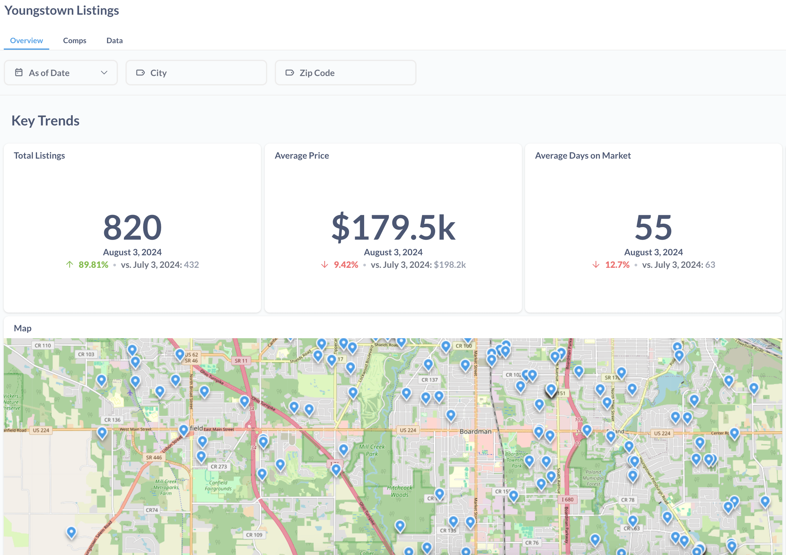
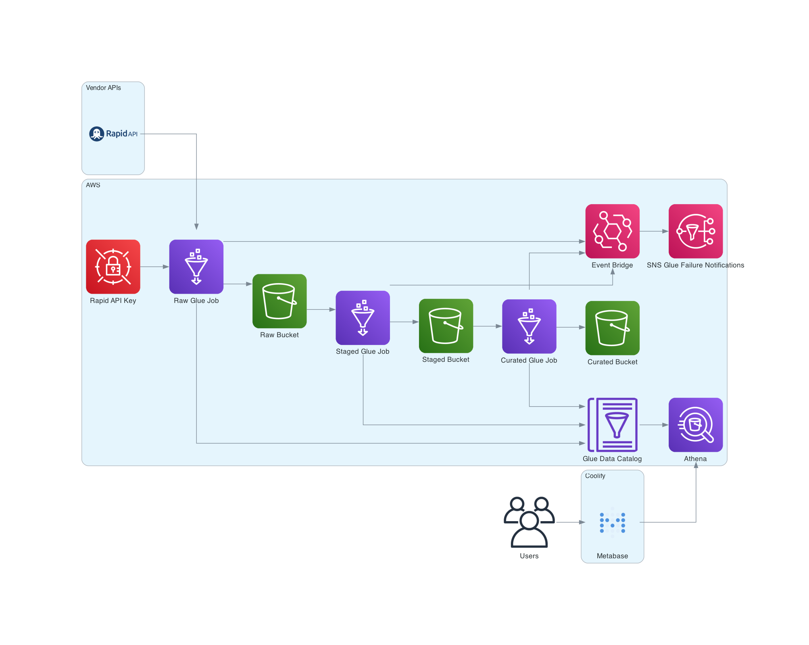

<a id="readme-top"></a>

<!-- HEADER -->
<div align="center">
  <a href="https://github.com/stephenodea54/ytown-listings">
    
  </a>

  <h3 align="center">Youngstown Listings</h3>

  <p align="center">
    A serverless ELT pipeline for analyzing the Youngstown, OH real estate market.
    <br />
    <br />
    <a href="https://metabase.stephenodea.me/public/dashboard/1bb4cb2e-ad20-454a-987b-1efec48ddc55?tab=34-overview&as_of_date=&city=&zip_code=">Product Demo</a>
    ·
    <a href="https://github.com/stephenodea54/ytown-listings/issues/new?labels=bug&template=bug-report---.md">Report Bug</a>
    ·
    <a href="https://github.com/stephenodea54/ytown-listings/issues/new?labels=enhancement&template=feature-request---.md">Request Feature</a>
  </p>
</div>


### Built With


</br>

</br>

</br>

</br>

</br>

</br>


<!-- TABLE OF CONTENTS -->
<details>
  <summary>Table of Contents</summary>
  <ol>
    <li>
      <a href="#about-the-project">About The Project</a>
      <ul>
        <li><a href="#project-overview">Project Overview</a></li>
        <li><a href="#motivation">Motivation</a></li>
      </ul>
    </li>
    <li>
      <a href="#system-design">System Design</a>
      <ul>
        <li><a href="#elt-pipeline-architecture">ELT Pipeline Architecture</a></li>
        <li><a href="#data-layer-definitions">Data Layer Definitions</a></li>
        <li><a href="#business-intelligence-solution">Business Intelligence Solution</a></li>
        <li><a href="#infrastructure-and-deployment">Infrastructure and Deployment</a></li>
      </ul>
    </li>
    <li>
      <a href="#getting-started">Getting Started</a>
      <ul>
        <li><a href="#prerequisites">Prerequisites</a></li>
        <li><a href="#installation">Installation</a></li>
      </ul>
    </li>
    <li><a href="#contributing">Contributing</a></li>
    <li><a href="#license">License</a></li>
    <li><a href="#contact">Contact</a></li>
    <li><a href="#acknowledgments">Acknowledgments</a></li>
  </ol>
</details>


<!-- ABOUT THE PROJECT -->
## About The Project

<a href="https://metabase.stephenodea.me/public/dashboard/1bb4cb2e-ad20-454a-987b-1efec48ddc55?tab=34-overview&as_of_date=&city=&zip_code=">
    
</a>

### Project Overview

The goal of this project is to create a scalable, serverless ELT (Extract, Load, Transform) solution for aggregating and processing real estate data in Youngstown, OH. This project leverages AWS services for data integration, storage, and transformation processes.

### Motivation

In 2024, two events prompted the initiation of this project:
  - My wife and I were having a baby and so I began a search for a larger home.
  - I began transitioning our company's on-premise data warehouse to an AWS-based architecture.

While searching for a home, I encountered challenges in obtaining a comprehensive view of the Youngstown market. The alternative, doom-scrolling Zillow, was no better. This project aims to address these challenges by providing a data platform to view all available listings and key metrics, facilitating a clearer understanding of listing distributions and trends across different markets.

Additionally, this project allows me an opportunity to enhance my AWS skills, blending practical requirements with professional growth.

<p align="right">(<a href="#readme-top">Back to top</a>)</p>


<!-- System Design -->
## System Design

<a href="https://github.com/othneildrew/Best-README-Template">
    
</a>

The data for this project is sourced from [Zillow](https://zillow.com) via the [Zillow API](https://rapidapi.com/apimaker/api/Zillow.com) available on [RapidAPI](https://rapidapi.com). This API was selected for the following reasons:

1. **Avoidance of Web Scraping**: Developing a custom web scraper would require investment in [residential proxies](https://oxylabs.io/blog/what-is-residential-proxy) to circumvent rate limits and IP bans.
2. **Cost Efficiency**: Given that the data extraction is limited to listings in Mahoning, Trumbull, and Columbiana counties, the volume of API requests remains within the free tier, assuming the ELT workflow is executed four times per month.

The API key required for accessing the API is securely managed using AWS Secrets Manager.

### ELT Pipeline Architecture:

The ELT process utilizes three AWS Glue jobs, each responsible for uploading data to one of three data layers: *raw*, *staged*, and *curated*. This architecture follows the principles of the [Medallion Architecture](https://www.databricks.com/glossary/medallion-architecture). Although a single script could handle the data ingestion due to the cleanliness of the data and the fact that it only comes from a single source, the multi-layer approach provides the following advantages:

  - **Scalability**: Can more easily handle the integration of additional data sources (for example, if we wanted to add school ratings or crime statistics).
  - **Separation of Concerns**: Ensures a clear delineation of responsibilities, simplifying the addition of new logic or data marts if those features become requested.

### Data Layer Definitions:

  - **Raw**: Represents a direct copy of the source data, intended solely for engineering use. End-users should not interact with this layer.
  - **Staged**: Contains data with basic transformations such as column renames and data type adjustments. In cases where multiple sources are used, relations would be joined in this layer to minimize code duplication in the curated layer.
  - **Curated**: Comprises aggregated metrics and key performance indicators (KPIs).

All data across these layers is cataloged in AWS Glue Data Catalog, enabling querying via Amazon Athena. Additionally, AWS EventBridge is configured to monitor each Glue job, sending email notifications in the event of errors.

### Business Intelligence Solution:

Metabase is used as the BI tool. The deployment of Metabase is not managed by an AWS service because it is hosted on a personal DNS through Coolify. This approach avoids additional container and database hosting costs. An alternative would be to deploy Metabase using AWS EC2, RDS, and VPC.

### Infrastructure and Deployment:

All resources are managed using AWS Cloud Development Kit (CDK) for Infrastructure as Code (IaC). Continuous Integration and Continuous Deployment (CI/CD) processes are handled using GitHub Actions.


<!-- GETTING STARTED -->
## Getting Started

### Prerequisites

The following technologies are required:
  - [`npm`](https://docs.npmjs.com/downloading-and-installing-node-js-and-npm)
  - [`python`](https://www.python.org/downloads/)
  - [`docker`](https://docs.docker.com/engine/install/)
  - [`docker compose`](https://docs.docker.com/compose/install/)
  - [`aws account`](https://aws.amazon.com/resources/create-account/)
    - Note that this project required paid resources (~$0.50)

### Installation

1. Clone the repo
   ```sh
   git clone https://github.com/stephenodea54/ytown-listings.git
   ```
2. Optionally uncomment the `pre-commit` package in `requirements.txt`
  - The `pre-commit` package is used to automatically lint and format code before it is committed. However, I only use this because I am lazy and the use of the precommit hooks is not required. For the reason why, check out [this wonderful rant from Theo](https://www.youtube.com/watch?v=LL01pLjcR5s&t=398s)
3. Activate a Python virtual env and install dependencies
   ```sh
   python3 -m venv .venv

   source .venv/bin/activate  # MacOS
   .venv\Scripts\activate.bat # Windows

   (.venv) pip install -r requirements.txt
   ```
4. Copy the contents of `.env.example` to a `.env` file and fill in the appropriate variables with your AWS Account ID and Region
   ```sh
   cp .env.example .env
   ```
4. Deploy resources using AWS CDK
   ```sh
   cdk deploy --profile your_profile_name
   ```
4. Get a free API Key at [RapidAPI](https://rapidapi.com) and subscribe to the [Zillow API](https://rapidapi.com/apimaker/api/Zillow.com).
5. Add this API Key to Secrets Manager:
   ```sh
   aws secretsmanager put-secret-value \
   --secret-id RapidAPIKey \
   --region your_region_name \
   --secret-string 'API_KEY_HERE' \
   --profile your_profile_name
   ```
6. Optionally, you can spin up a local instance of Metabase and Postgres using the docker compose file:
   ```sh
   docker compose up
   ```

<p align="right">(<a href="#readme-top">Back to top</a>)</p>


<!-- CONTRIBUTING -->
## Contributing

Contributions are what make the open source community such an amazing place to learn, inspire, and create. Any contributions you make are **greatly appreciated**.

If you have a suggestion that would make this better, please fork the repo and create a pull request. You can also simply open an issue with the tag "enhancement".
Don't forget to give the project a star! Thanks again!

1. Fork the Project
2. Create your Feature Branch (`git checkout -b feature/AmazingFeature`)
3. Commit your Changes (`git commit -m 'Add some AmazingFeature'`)
4. Push to the Branch (`git push origin feature/AmazingFeature`)
5. Open a Pull Request

<p align="right">(<a href="#readme-top">Back to top</a>)</p>


<!-- LICENSE -->
## License

Distributed under the MIT License. See `LICENSE.txt` for more information.

<p align="right">(<a href="#readme-top">Back to top</a>)</p>


<!-- CONTACT -->
## Contact

Stephen O'Dea - [https://stephenodea.me](https://stephenodea.me) - hey@stephenodea.me

Project Link: [https://github.com/stephenodea54/ytown-listings](https://github.com/stephenodea54/ytown-listings)

<p align="right">(<a href="#readme-top">Back to top</a>)</p>


<!-- ACKNOWLEDGMENTS -->
## Acknowledgments

* [othnieldrew's README Template](https://github.com/othneildrew/Best-README-Template)
* [AWS CDK Workshop](https://catalog.us-east-1.prod.workshops.aws/workshops/10141411-0192-4021-afa8-2436f3c66bd8/en-US/3000-python-workshop)
* [Diagrams](https://diagrams.mingrammer.com/docs/getting-started/installation)

<p align="right">(<a href="#readme-top">Back to top</a>)</p>
